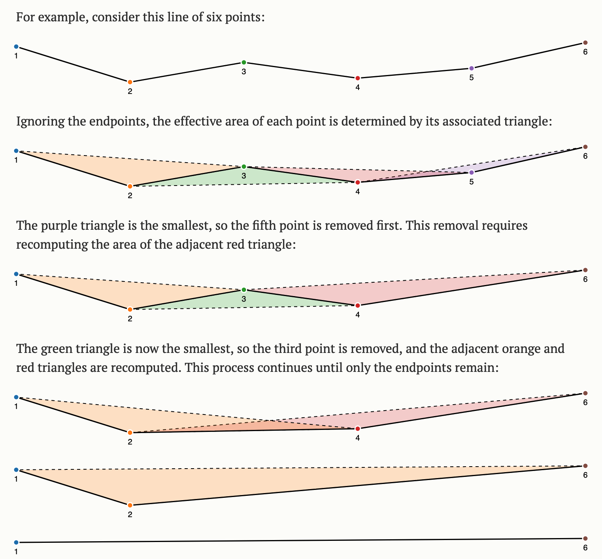

<!-- README.md is generated from README.Rmd. Please edit that file -->

```{r, include = FALSE}
knitr::opts_chunk$set(
  collapse = TRUE,
  comment = "#>",
  fig.path = "man/figures/README-",
  out.width = "100%"
)

suppressPackageStartupMessages({
  library(dplyr)
  library(ggplot2)
  library(tidyr)
  library(rworldmap)
  library(rworldxtra)
})
library(visvalingam)
```

# visvalingam

<!-- badges: start -->

[](https://github.com/coolbutuseless/visvalingam/actions)
<!-- badges: end -->

`{visvilingam}` implements Visvilngam's Line Simplification Algorithm, 
which is described well [here](https://en.wikipedia.org/wiki/Visvalingam%E2%80%93Whyatt_algorithm),
[here](https://bost.ocks.org/mike/simplify/) and [here](http://bl.ocks.org/msbarry/9152218).


### Algorithm Overview

Visvalingam's algorithm iteratively deletes vertices from a line with the deletion decision based upon the effective
area of the triangle defined by the vertex and its current neighbours.

The vertex with the minimal area is removed from the line at each iteration
until the target number of points is reached.

Note that when vertices are removed from the line, the effective areas of the
neighbouring vertices need to be recalculated.

The need to find/delete the node with minimum 
effective area at every iteration means that a *min heap* (AKA *priority queue*) 
will be needed for efficient calculation.

A priority queue is used in the C version of the algorithm in this package, 
but the R version remains a straightforward/naive implementation for 
illustrative purposes.

### Algorithm Visual Explanation

Image Credit: [Mike Bostock](https://bost.ocks.org/mike/simplify/)



### What's in the box

* `vis_simplify(x, y, n)` to simplify the given line (defined by its `x` and `y` 
coordinates) down to just `n` vertices.  Implemented in C.
* `vis_indices(x, y, n)` return a logical vector of indiciating the location of 
  the `n` simplified points in the original vectors.
* `vis_effective_areas(x, y)` calculates the effective areas for all vertices.
  End points are assigned an infinite area.  Implemented in C.


#### For illustrative purposes

* `vis_simplify_r(x, y, n)` a plain R version of the algorithm.  The purpose of 
  this function is to illustrate the algorithm. It is **not** efficient.


## Installation

You can install from [GitHub](https://github.com/coolbutuseless/visvalingam) with:

``` r
# install.package('remotes')
remotes::install_github('coolbutuseless/visvalingam')
```

## Line Simplification

#### Raw map of Mainland Australia

```{r raw_australia}
library(rworldmap)
library(rworldxtra)

# Extract map of mainland Australia
map       <- rworldmap::getMap(resolution = 'high')
australia <- map@polygons[[which(map$ADMIN.1 == 'Australia')]]
mainland  <- australia@Polygons[[1]]@coords
nrow(mainland)

plot(mainland, type = 'l', asp = 1)
title(sprintf("Mainland Australia\n%i points", nrow(mainland)))
```

#### Simplified map of Australia (n = 100)

```{r simplified_australis}
# `simplify()` returns a simple list of the remaining x,y coordinates
res <- visvalingam::vis_simplify(mainland[,1], mainland[,2], n = 100)
class(res)
names(res)

plot(res, type = 'l', asp = 1)
title(sprintf("Mainland Australia\n%i points", 100))
```


## Manually filtering using *effective areas*

#### Raw map of Tasmania
```{r raw_tassie}
library(rworldmap)
library(rworldxtra)

# Extract map of Tasmania
map       <- rworldmap::getMap(resolution = 'high')
australia <- map@polygons[[which(map$ADMIN.1 == 'Australia')]]
tassie    <- australia@Polygons[[2]]@coords
nrow(tassie)

plot(tassie, type = 'l', asp = 1)
title(sprintf("Tasmania\n%i points", nrow(tassie)))
```


#### Map of Tasmania removing 99% of points

```{r simplified_tassie}
# `effective_areas` returns a numeric area associated with each vertex
areas <- visvalingam::vis_effective_areas(tassie[,1], tassie[,2])
quantile(areas)

# Remove 99% of the vertices
threshold <- quantile(areas, probs = 0.99)
tassie_small <- tassie[areas > threshold,]

plot(tassie_small, type = 'l', asp = 1)
title(sprintf("Tasmania\n%i points", nrow(tassie_small)))
```


## Benchmark

**Test case:** Simplify a line of 1000 points down to just 10 points.

Most other related packages that offer line simplification need `sp` or `sf` or
other spatial geometry objects as input.

If anyone wanted to replicate this current benchmark for these pacakges, I will
happily add them here.

```{r}
set.seed(1)
N <- 1000
x <- runif(N)
y <- runif(N)

res <- bench::mark(
  vis_simplify(x, y, 10),
  vis_simplify_r(x, y, 10)
)
```

```{r bench, echo=FALSE}
res %>%
  select(1:5) %>%
  knitr::kable()

plot(res)
```


## Related Software

* [GRASS](https://grass.osgeo.org/grass80/manuals/v.generalize.html)
* [`{edgebundle`}](https://github.com/schochastics/edgebundle/blob/main/R/flow_tnss.R#L280) 
  has a plain R DouglassPeucker algo implementation
* [CGAL](https://doc.cgal.org/latest/Polyline_simplification_2/index.html)
* [`{smoothr}`](https://cran.r-project.org/web/packages/smoothr/vignettes/smoothr.html)
  has a kernel smooting implementation.
* [mapshaper](https://github.com/mbloch/mapshaper)/[`{rmapshaper}`](https://cran.r-project.org/package=rmapshaper)
  spatially aware polygon simplification

## Acknowledgements

* R Core for developing and maintaining the language.
* CRAN maintainers, for patiently shepherding packages onto CRAN and maintaining
  the repository


